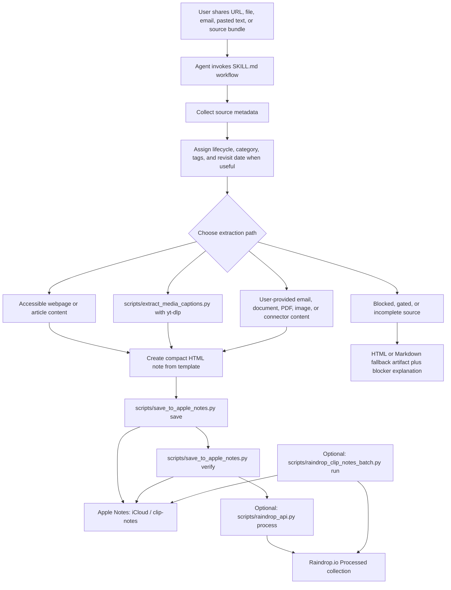

# Architecture

Clip Notes is a small local Agent Skill. The canonical behavior lives in `SKILL.md`; helper scripts perform local extraction and Apple Notes automation.

## Components

| Component | Path | Responsibility |
| --- | --- | --- |
| Skill contract | `SKILL.md` | Defines when to use the skill, the note template, classification rules, source handling, and done criteria. |
| Source tactics | `references/source-strategies.md` | Provides edge-case guidance for extraction and failure handling. |
| Share workflow guide | `references/share-workflows.md` | Explains expected usage from Codex, ChatGPT, iOS, and macOS sharing surfaces. |
| Apple Notes helper | `scripts/save_to_apple_notes.py` | Wraps AppleScript commands for folder creation, save, verify, move, list, and spacing restyle operations. |
| Media captions helper | `scripts/extract_media_captions.py` | Uses `yt-dlp` to write media metadata and caption-derived transcripts under `work/clip-notes-media`. |
| Raindrop API helper | `scripts/raindrop_api.py` | Uses the Raindrop.io REST API to list Inbox and Unsorted bookmarks and move processed bookmarks with matching note tags. |
| Raindrop batch runner | `scripts/raindrop_clip_notes_batch.py` | Creates metadata-based Apple Notes for Raindrop review items, verifies notes by embedded Raindrop ID, then moves verified bookmarks to Processed with matching tags and rate-limit backoff. |
| Agent display metadata | `agents/openai.yaml` | Provides display name, short description, and default prompt. |

## Source-to-Note Flow

## Apple Notes Boundary

`scripts/save_to_apple_notes.py` calls `osascript` and sends AppleScript to the local Notes app. It defaults to account `iCloud` and folder `clip-notes`, but both are configurable with command-line flags.

The helper does not authenticate to Apple services itself. It depends on the local macOS user session, Notes account configuration, and automation permissions.

## Media Extraction Boundary

`scripts/extract_media_captions.py` shells out to `yt-dlp`. It writes:

- `metadata.json`
- downloaded `.vtt` caption files when available
- `transcript.txt` when captions can be cleaned

The default output directory is `work/clip-notes-media`, which is ignored by Git.

## Raindrop API Boundary

`scripts/raindrop_api.py` uses the official REST API base URL `https://api.raindrop.io/rest/v1`. It reads a bearer token from `RAINDROP_ACCESS_TOKEN` or `RAINDROP_TOKEN`, lists raindrops from an Inbox collection and Raindrop's Unsorted system collection by default, and updates a processed raindrop with:

- `tags`: the existing tags plus canonical Apple Note tag names.
- `collection`: `{"$id": <processed_collection_id>}`.

The helper defaults to review sources named `Inbox` and `Unsorted`, then moves completed items to `Processed`, with environment and CLI overrides for collection names or IDs. It does not call the Raindrop.io MCP endpoint.

`scripts/raindrop_clip_notes_batch.py` builds on the same API boundary for queue cleanup. It fetches review items in pages of at most 50, creates Apple Notes from Raindrop metadata, verifies notes by looking for the embedded Raindrop ID in the note title or body, then updates only verified bookmarks. It sleeps between successful moves and retries HTTP 429 rate limits with backoff.

## Data and Trust Boundaries

- User-provided private content should stay within the local agent context and Apple Notes output unless the user explicitly authorizes broader lookup.
- Gated content should not be reconstructed from snippets or assumptions.
- Local `work/` artifacts may contain transcripts or metadata and should be treated as private user data.
- Saved Notes contain source links, metadata, summary text, and any user-relevant action items.
- Raindrop API tokens grant bookmark access and should stay in environment variables or an external secret manager, not committed files.

## Extension Points

- Additional source strategies can be added under `references/`.
- More helper commands can be added to `scripts/save_to_apple_notes.py` if Apple Notes operations expand.
- Additional Raindrop processing modes can be added to the batch runner if future workflows need richer extraction or collection-specific rules.
- A packaging or installation script can be added if the current direct skill-directory use becomes insufficient.

<!-- TODO: Confirm whether this repository should include a canonical `AGENT-FLOW.md` file or rely on external Agent-Flow instructions. -->
