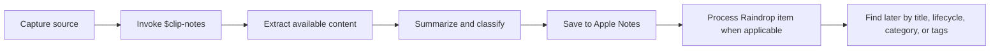

# Visuals

This project has no graphical app UI. Visual documentation should focus on the source-to-note workflow, Apple Notes output, and user sharing flows.

## Existing Diagram Inventory

| Location | Format | Purpose |
| --- | --- | --- |
| `docs/ARCHITECTURE.md` | Mermaid flowchart | Shows how a shared source becomes an Apple Note and optionally moves from Raindrop Inbox or Unsorted to Processed. |

## Recommended Screenshot Set

Capture these when a real end-to-end run is available:

| Asset | Purpose |
| --- | --- |
| Apple Notes `clip-notes` folder | Shows where saved notes land. |
| A finished clip note | Demonstrates metadata, tags, summary, action items, and limitations. |
| macOS Codex invocation | Shows the expected desktop workflow. |
| Raindrop Inbox, Unsorted, and Processed collections | Shows the before/after state for processed bookmarks without exposing private source content. |
| iOS Share Sheet handoff | Shows how mobile capture can feed Clip Notes or ChatGPT. |

Store screenshots under `docs/assets/` if they are added. Do not include private source text in screenshots unless the user explicitly approves it.

## Demo Video Plan

A short demo can cover:

1. Share a source URL to Codex on macOS.
2. Run `$clip-notes`.
3. Show content extraction or fallback handling.
4. Save the HTML note through Apple Notes automation.
5. Verify the note title.
6. If the source came from Raindrop Inbox, move the bookmark to Processed and apply matching tags.
7. Open the saved note in the `clip-notes` folder.

Keep the demo under two minutes and use a non-sensitive public source.

For recurring use, capture a second short demo that starts from populated Raindrop Inbox and Unsorted views, processes one item through Codex, then shows the item in Processed and the matching Apple Note.

## User Journey Diagram

## Visual Standards

- Use Mermaid for implementation diagrams because the workflow is source-controlled and changes with code.
- Use screenshots only from real flows with non-sensitive content.
- Prefer dense, practical visuals over decorative imagery.
- Do not create marketing images or generated concept art unless the project gets an explicit launch, pitch, or stakeholder communication goal.

<!-- TODO: Capture real screenshots after the next successful non-sensitive Apple Notes save. -->
